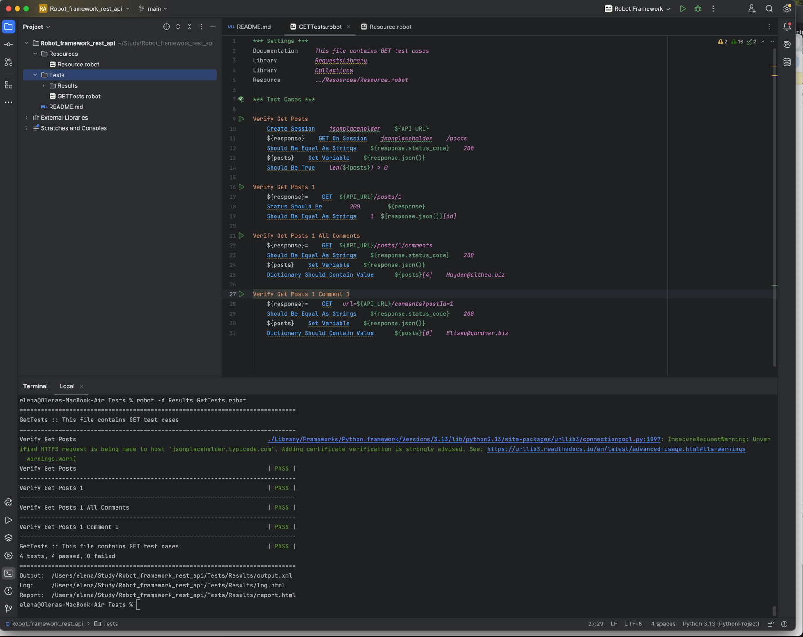
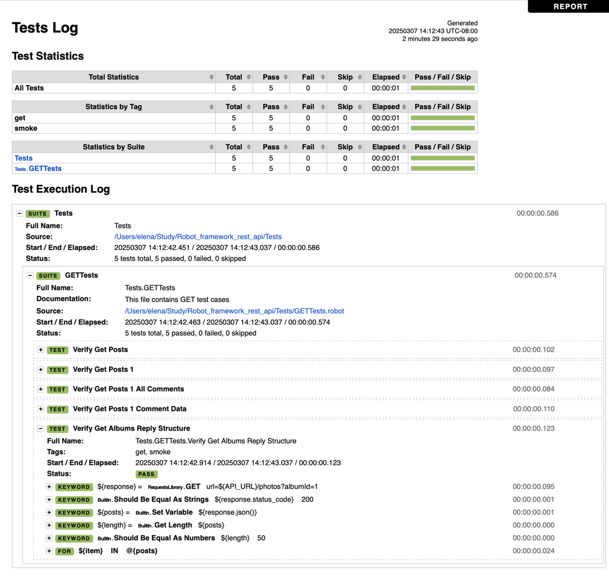

# Robot_framework_rest_api
[Robot Framework](https://robotframework.org/) is an open source automation framework for test automation and robotic process automation (RPA). It has a rich ecosystem of libraries for various testing needs, including web testing (Selenium), API testing, and more.

This repository contains a sample of testing REST API using Robot Framework and RequestsLibrary. 

All information about the API that is used in this example can be found here: https://jsonplaceholder.typicode.com/

## Setup

Install Robot Framework:
```
pip install robotframework
```

Install Request library:
```
pip install robotframework-requests
```
Documentation for all keywords available in RequestsLibrary is [here](https://marketsquare.github.io/robotframework-requests/doc/RequestsLibrary.html)


## Developing tests
You can use PyCharm to review and update test cases. Add **Hyper RobotFramework Support** plug-in:
```
PyCharm -> Settings -> Plug-ins 
```
All test suites files should have .robot extension. All test suites and test cases can have setup and teardown instructions and tags.

## Running tests

To execute all test cases, open a terminal in PyCharm and run this command to run test cases and save all results in Results folder
```
robot -d Results .
```

To execute only test cases with a specific tag:
```
robot -i tag  -d Results .
```




## Reviewing results
Results will be saved in generated html files, and you can open them by clicking on links in a terminal:

